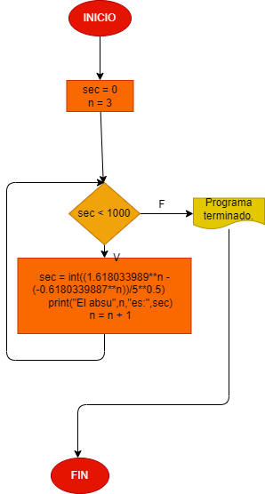

# La serie figonashi es una secuencia numerica, en la cual cada elemento es igual a la suma de los dos anteriores. Tomando como variales iniciales los dos primeros elementos, a = 0 b=1 hacer el diagrama y el programa el python, que calcule y imprima apartir del tercero, todos los elementos de la serie de figonashii que sean menores de 1000

# Analisis

## Diagrama de flujo.
